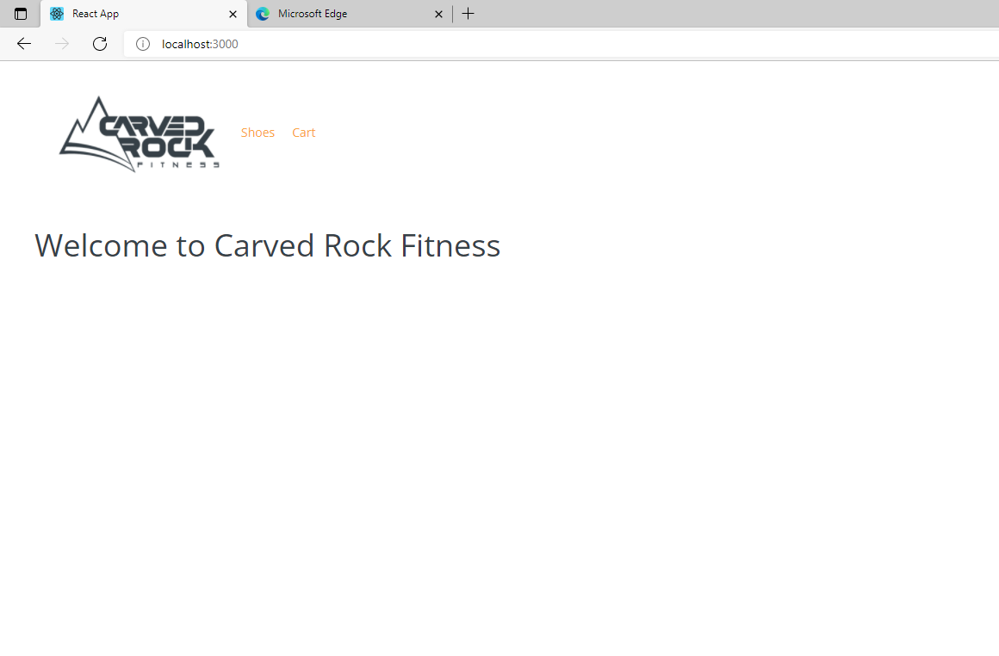
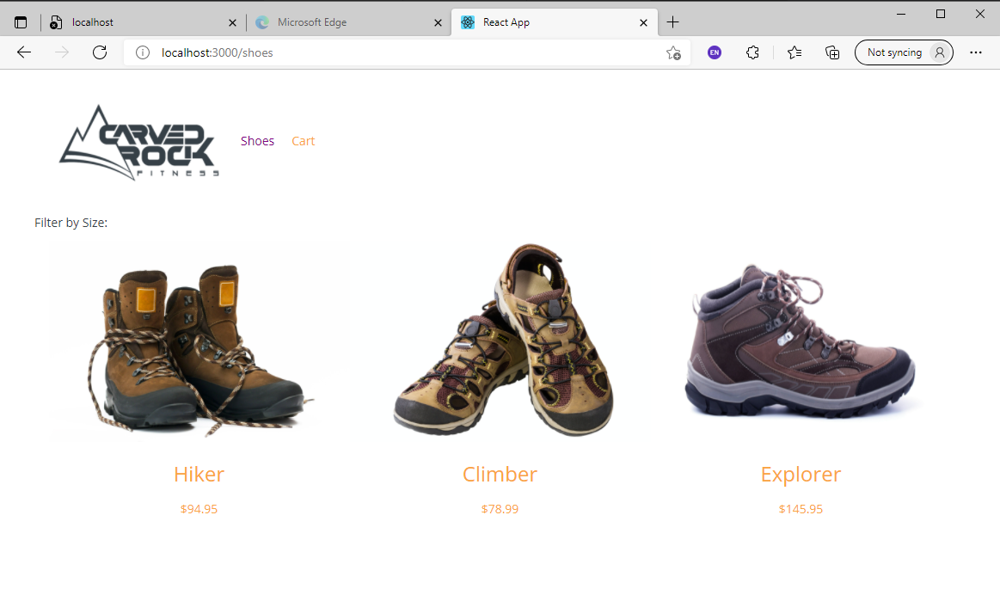
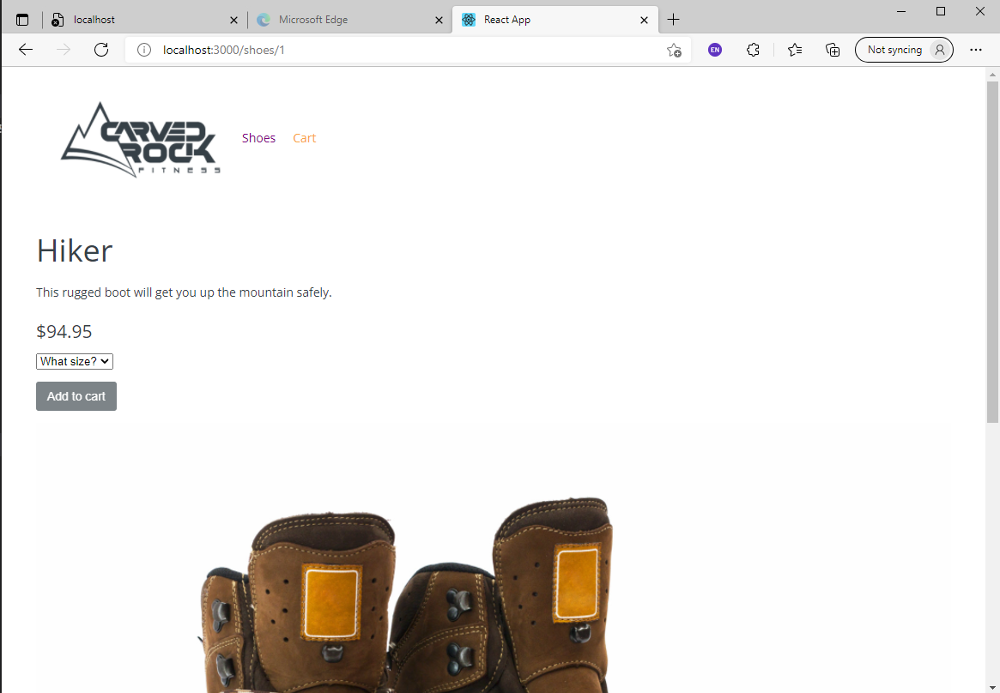
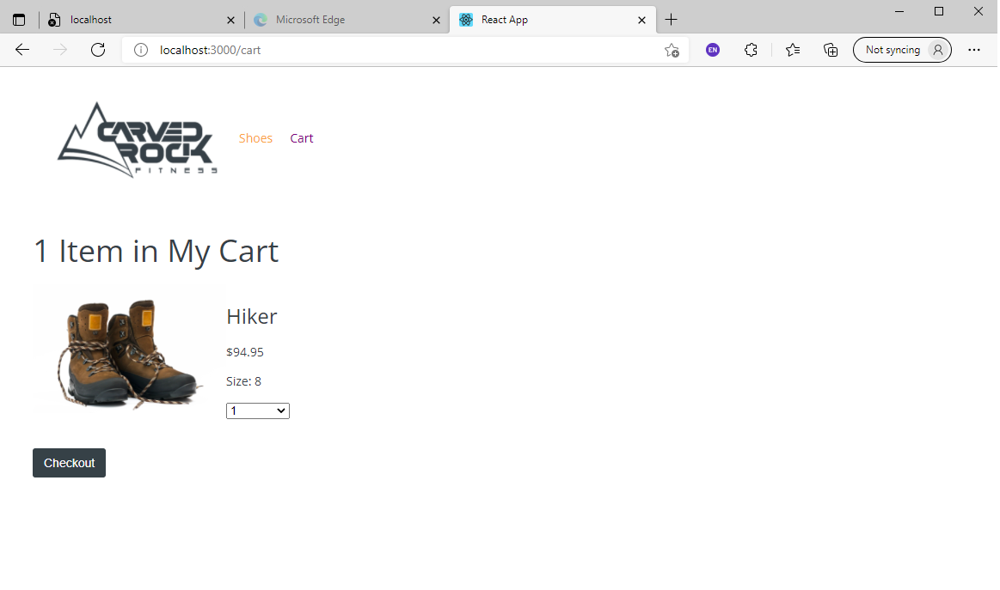
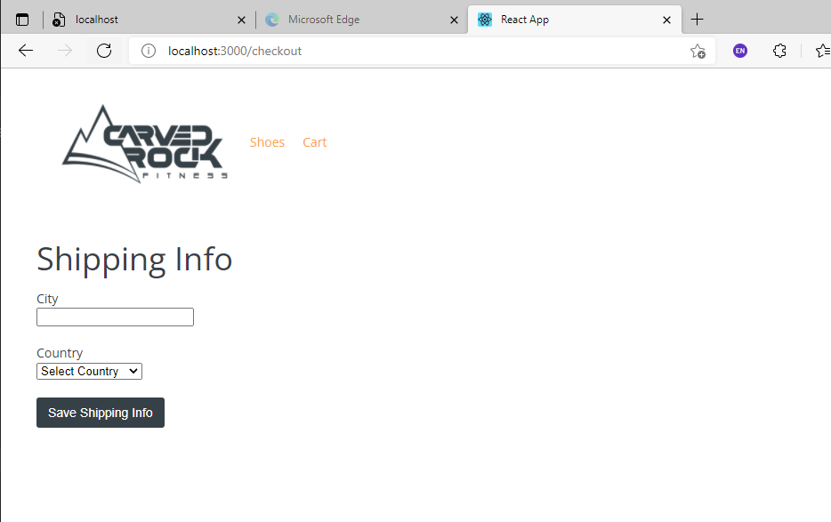

# React Shoe Store
## Author: WellAndGood

# Table of Contents
* [Overview](#overview)
* [Appearance](#appearance)
* [Contributors](#contributors)
* [License](#license)

# Overview

This document describes the components of a front-end mock-up shoe store using Javascript, Node, Express, React (and related libraries such as React DOM). 

This project stressed the importance of state through a variety of methods:
- Local and global state (with hooks)
- Routing and useNavigation hook
- Shared state
- Derived state
- Immutable state
- Refs and Reducers
- Context
- Class components (included though not deployed; caused errors)

IMPORTANT NOTE: This was a directed project through PluralSight.

# Appearance 
Once loaded, the generated page should look like this:  

Clicking on the 'Shoes' button on the nav bar brings you to the selection, which allows you to choose from the selection of shoes. This selection comes from a local `db.json` file: 
  

If you click on an individual shoe, you are taken to a Router-based URL, using the shoe's unique ID for its navigation:

 

You can click the `What Size?` dropdown list gives you the available shoe sizes. The `Add to cart` button is disabled until you select one. Clicking the `Add to cart` button takes you to the `/cart` route. You can also click the `Cart` button on the nav to be taken to cart at any time.

 

Clicking on the 'Checkout' button takes you to a mock form. You may add your city and choose from a set of countries, then hit the `Save Shipping Info` button to "submit" your order.

You can access the `.git` files at:
https://github.com/WellAndGood/TechBlogHandlebars.git

## Contributors
Daniel Pisani (WellAndGood)

# Contact
* GitHub account: WellAndGood

## License
This project is licensed under:

### MIT License

Copyright (c) 2021 Daniel Pisani (WellAndGood) 

Permission is hereby granted, free of charge, to any person obtaining a copy of this software and associated documentation files (the "Software"), to deal in the Software without restriction, including without limitation the rights to use, copy, modify, merge, publish, distribute, sublicense, and/or sell copies of the Software, and to permit persons to whom the Software is furnished to do so, subject to the following conditions:

The above copyright notice and this permission notice shall be included in all copies or substantial portions of the Software.

THE SOFTWARE IS PROVIDED "AS IS", WITHOUT WARRANTY OF ANY KIND, EXPRESS OR IMPLIED, INCLUDING BUT NOT LIMITED TO THE WARRANTIES OF MERCHANTABILITY, FITNESS FOR A PARTICULAR PURPOSE AND NONINFRINGEMENT. IN NO EVENT SHALL THE AUTHORS OR COPYRIGHT HOLDERS BE LIABLE FOR ANY CLAIM, DAMAGES OR OTHER LIABILITY, WHETHER IN AN ACTION OF CONTRACT, TORT OR OTHERWISE, ARISING FROM, OUT OF OR IN CONNECTION WITH THE SOFTWARE OR THE USE OR OTHER DEALINGS IN THE SOFTWARE.